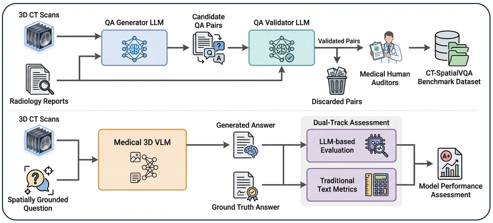

<p align="center"><h1 align="center">CT-SPATIALVQA</h1></p>




## CT‑SpatialVQA Dataset

CT‑SpatialVQA is a benchmark designed to evaluate **semantic–spatial reasoning** in 3D CT. It contains **9,077** clinically grounded question–answer (QA) pairs derived directly from **1,601** CT radiology reports and volumes (CT‑RATE). The QA set is validated via an LLM‑assisted pipeline with a **95%** human consensus agreement rate (see `MICCAI2026.pdf`).

The questions require explicit:
- Anatomical localization
- Laterality awareness
- Structural comparison
- 3D inter‑structure relational reasoning

Example figures from the paper:
- `Figures/ct_rep_qa_1.png` (CT + report + QA)
- `Figures/ct_qa_pred_1.png` (model responses)
- `Figures/qa_pred_dist.png` (text length distribution)

## Spatial Categories

CT‑SpatialVQA targets six spatial dimensions:
- Laterality & Bilateral Symmetry (left/right/bilateral)
- Longitudinal (Vertical) Position (superior/inferior)
- Anterior–Posterior (Depth) Relations
- Medial–Lateral Orientation (Centricity) (central/peripheral)
- Adjacency & Containment
- Spatial Extent & Boundaries (confined vs. extending)

Radar plot: `Figures/category_radar_plot.pdf`

## Dataset Files

Location: `dataset/ct_spatialvqa/`

- `dataset/ct_spatialvqa/spatial_qa_filtered_full.json` — final filtered QA pairs (JSON)
- `dataset/ct_spatialvqa/spatial_qa_filtered_full_nifti.jsonl` — QA pairs with `image_path` (generic JSONL)
- `dataset/ct_spatialvqa/spatial_qa_filtered_full_cases.jsonl` — case‑structured JSONL (generic)

The JSONL schema is:
```json
{"case_id":"...","image_path":"...","question":"...","answer":"..."}
```

`image_path` points to CT‑RATE volumes under:
```
dataset/data_volumes/dataset/valid_fixed/...
```

## Download CT‑RATE Volumes

CT‑SpatialVQA distributes QA pairs and paths, but **not** the CT volumes themselves. Use the CT‑RATE dataset and download the volumes via:

```bash
export HF_TOKEN=YOUR_HF_TOKEN
python dataset/download_ctrate_dataset.py
```

The script writes volumes to `dataset/data_volumes/` to match the JSONLs.

## Repository Layout

- `dataset/` — CT‑SpatialVQA release + CT‑RATE download script
- `QA_generation/` — QA generation + LLM validation + filtering pipeline (plus human audit artifacts)
- `benchmarking/` — benchmarking stack (preprocess, inference, evaluation, reports)

## Technical Details

Implementation details (environments, model setup, inference, evaluation) are documented in:
- `benchmarking/README.md`
- `QA_generation/README.md`

## Citation

If you use this dataset or code, please cite the paper in `MICCAI2026.pdf`.

